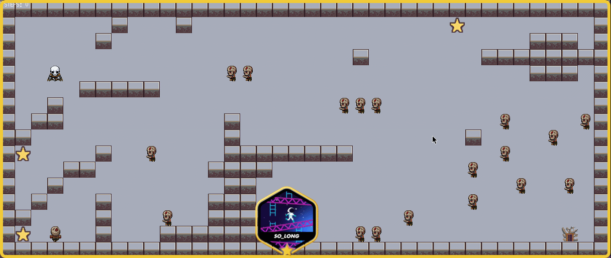

<div>
<p align="center">
   
</p>
</div>
<p align="center">	
   <a href="https://www.linkedin.com/in/luiz-lima-cezario/">
      
   </a>

  <a aria-label="Completed" href="https://www.42sp.org.br/">
    </img>
  </a>
  <a href="https://github.com/luizlcezario/So_Long/commits/master">
    
  </a> 

  <a href="https://github.com/luizlcezario/So_Long/stargazers">
    
  </a>
</p>

<div align="center">
  <sub>So Long of 42. Make with ❤︎ for
        <a href="https://github.com/luizlcezario">Luiz Cezario</a> 
    </a>
  </sub>
</div>

# SoLong

This project is a very small 2D game, with very basic gameplay elements. We use the [minilibx-linux](https://github.com/42Paris/minilibx-linux) and X11 graphic server. 

## Gameplay
The player has to dodge enemies and collect all bonuses to escape. The map (`.ber`) is loaded as an argument in the execution of the program.
<div align="center">

</div>
# :construction_worker: How to Run
```bash
# If you want a Script for testing use this :
# https://github.com/luizlcezario/Libft_Test.git

# Clone the Repo
$ git clone https://github.com/luizlcezario/So_Long.git

# Enter in the Folder
$ cd So_Long

# *************COMMANDS************ #
# run - run compile all the libtest with the your libft and run the a map
$ make all 
$ ./so_long "./assets/maps/map_3.ber"

```

# My Team for this project
We are [Luiz Lima](http://github.com/luizlcezario), [Paulo Rafael Ramalho](http://github.com/yaten) and [Van Antonietti](http://github.com/VanAntonietti).

Made with pair programming

> So long, and thanks for all the fish!

Give ⭐️ if you like this project, this will help me!
